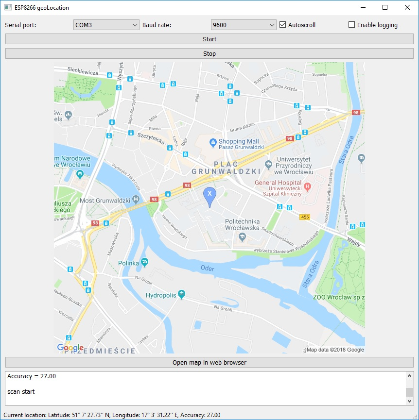

# ESP8266-geoLocation

Simple application which allows to visualise current location using ESP8266 and Google Maps Static API

## Requirments

* ESP8266 with code (project was build based on geolocation code: https://github.com/techiesms/Geolocation by user: techiesms)
* Google  Geolocation API Key
* Google Maps Static API Key

## Functions

* Automatically detects active COM port
* Allow to log into a file (default folder for log files is: serialMonitorLogs)
* Autoscroll focus cursor on current received line
* Visualise current ESP8266 location on map

## Screenshot:

